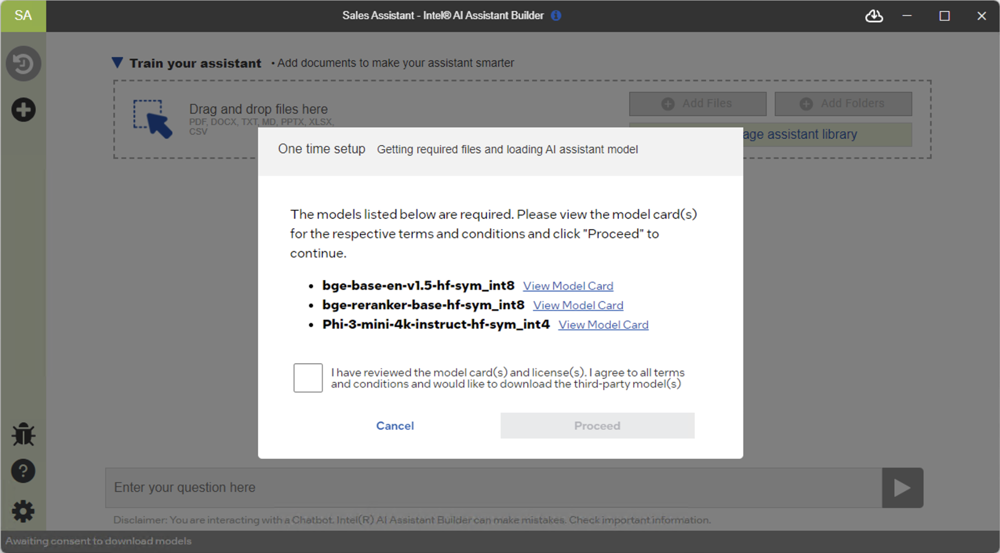
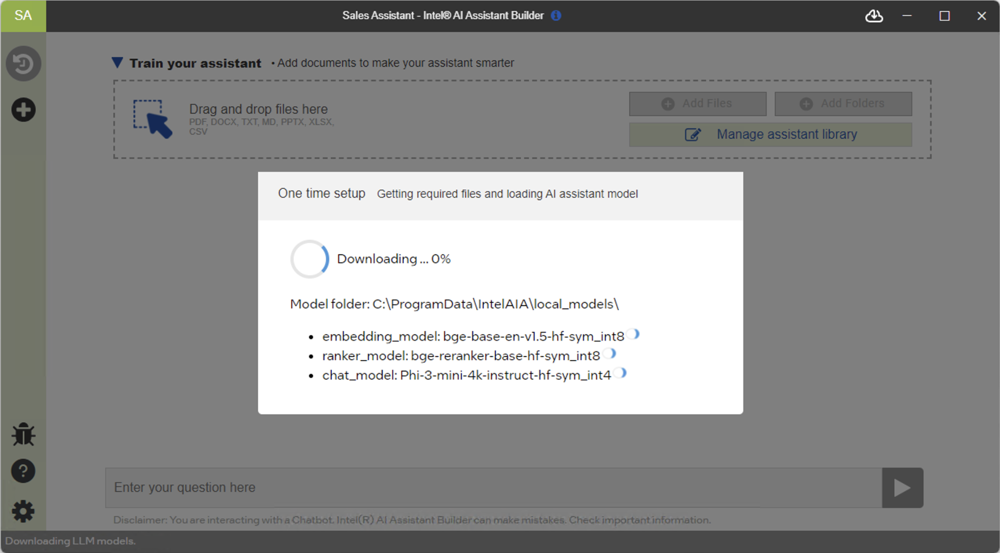
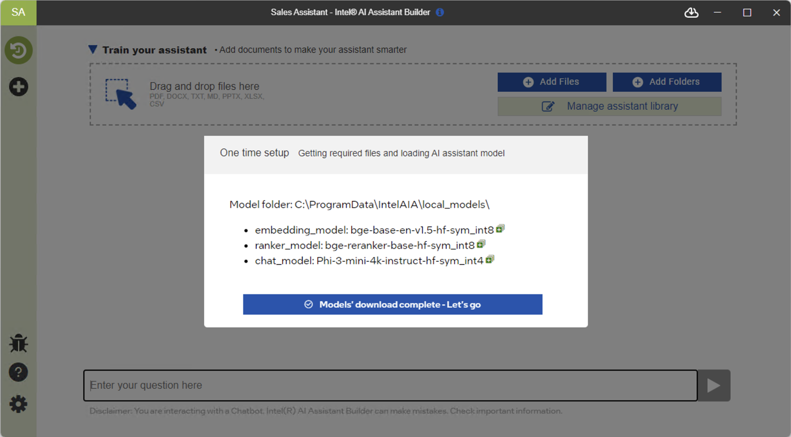
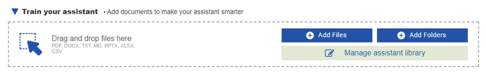
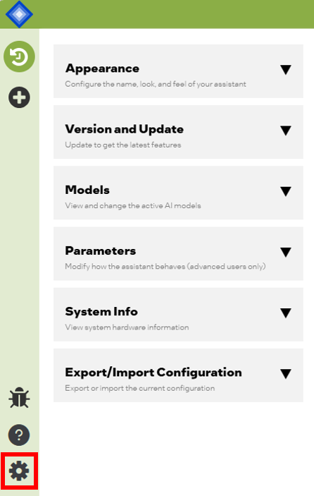
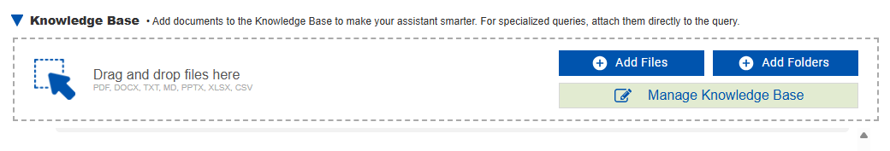
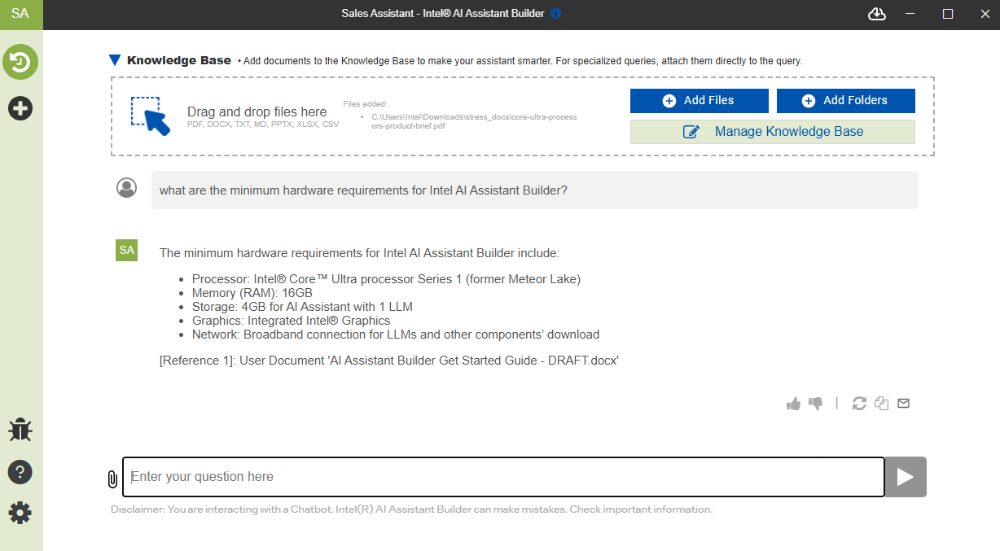
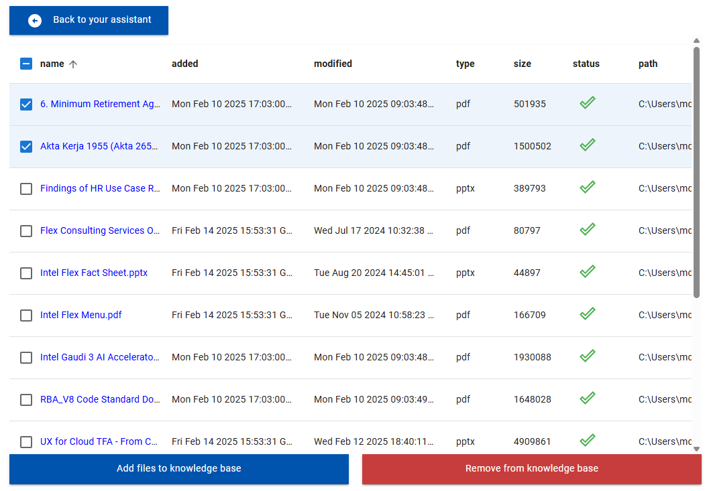

**First time use and initial setup**

The first time the application runs certain required files will need to be downloaded. Accept the terms and conditions of use and then click “Proceed” for the download to begin.

The status bar at the bottom of the window indicates the application status and is removed when the download is complete.

LLM, RAG, and Other Components’ Download Dialogue Window:  
Download in Progress and Download Complete

The AI Assistant can’t be used until all required files are downloaded and “activated”. This is only required the first time the assistant runs and typically takes a few minutes at most to complete, however depending on network conditions and specific system hardware the process could take longer.

**Adding documents to the assistant**

“Train your assistant” by adding relevant documents.

Intel® AI Assistant Builder Application Interface for File and Folder Loading

**Customize the assistant - Settings**

You can further customize your AI Assistant by clicking the settings icon on the left sidebar.

Some of available settings include:

-   Customize the appearance and name.
-   Change the LLM and RAG models and/or upload custom models.
-   Adjust LLM and RAG parameters.
-   View the hardware details of your AI PC.
-   Import or Export a “built” assistant configuration

**Using the assistant – Basic functions**

Your assistant is much smarter and more helpful when you add documents to the “knowledge base” in order to give it context and references for your topic of interest.

Knowledge base / File library: Train your assistant by adding files and documents to the common “Knowledge Base”. The assistant will use this knowledge base as a reference to find relevant information to answer your questions. The assistant will also note which document it used to answer any questions you ask. The knowledge base is shared across chat sessions and remains in place unless you choose to remove or replace a document.

Supported file formats include PDF, DOCX, TXT, MD, PPTX, XLSX, CSV

A basic chat after documents have been added is shown below:

The Knowledge Base is managed by clicking the “Manage Knowledge Base” button where you may add or remove files as needed.

*\*PRO Tip:* When documents are added or removed from the knowledge base the source documents are not moved and remain unchanged. Only the embeddings of the files are stored in the knowledge base.
